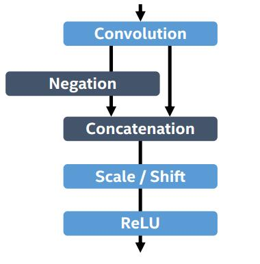
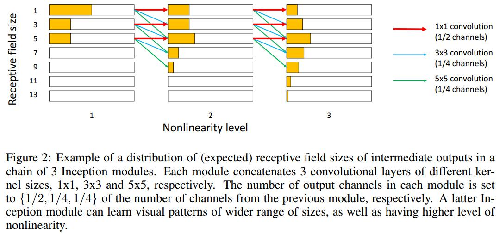
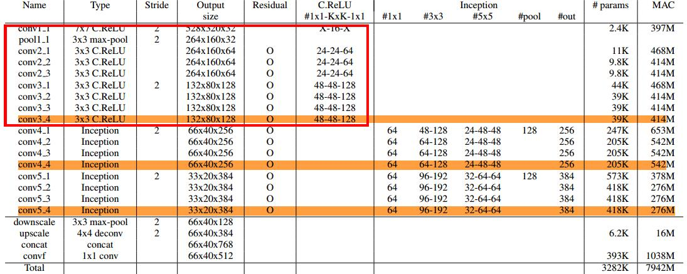

## Abstract
1. 使用"Feature Extraction+Region Proposal+RoI Classification" 的结构，主要对Feature Extraction进行重新设计。因为，Region Proposal部分计算量不太大而且classification部分可以使用通用的技术(例如：Truncated SVD) 进行有效的压缩。
2. 设计原则：Less channels with more layers 和采用一些Building blocks （包括：串级的ReLU、Inception和HyperNet)

```
  结果 
  VOC2007—83.8\%mAP；VOC2012—82.5\%mAP，46ms/image在NVIDIA Titan X GPU；计算量是ResNet-101的12.3\% (理论上)
```

## Introduction

准确率很高的检测算法有往往需要很大的计算量。现在压缩和量化技术的发展对减小网络的计算量很重要。这篇文章展示了我们用于目标检测的一个轻量级的特征提取的网络结构——PVANET

串级的ReLU(C.ReLU—Concatenated rectified linear unit)被用在我们的CNNs 的初期阶段来减少一半的计算数量而不损失精度。

Inception被用在剩下的生成feature的子网络中。一个Inception module 产生不同大小的感受野（receptive fields）的输出激活值，所以增加前一层感受野大小的 变化。 我们观察叠加的Inception modules可以比线性链式的CNNs更有效的捕捉大范围的大小变化的目标。

采用multi-scale representation的思想, 结合多个中间的输出，所以，这使得可以同时考虑多个level的细节和非线性。我们展示设计的网络deep and thin，在batch normalization、residual connections和基于plateau detection的learning rate的调整的帮助下进行有效地训练

##  Review Related Work

### HyperNet
Hypernet[2]算是在物体识别任务中的一个多尺度利用特征的里程碑吧，其中主要贡献有两点：
* 同时利用第1， 第3和第5卷积层的输出结果作为分类特征
* 将有效改变ROI推荐模块中的工作任务，提高了任务处理速度


### Inception
Inception最早是在NIN中提出来的，但是其中没有1x1卷积核的掺入，导致一些问题。后来在GoogLeNet中重新设计了Inception模块，有效地拓展了当时对卷积结构的认识，使得神经网络向着更深的模型方向发展。Inception最有创造性的是对于同一个输入数据，采用不同尺度的感受野(卷积核)进行处理，将不同尺度的信息通过级联方式进行组合。这种将多尺度特征引用到后面网络层中的方式，受到设计深层网络人的追捧。


## Nerual Network Design
### C.ReLU

    C.ReLU来源于CNN中间激活模式引发的。观察发现，输出节点倾向于是"配对的"，一个节点激活是另一个节点的相反面。



* 求同
    C.ReLU减少一半输出通数量，通过简单的连接相同的输出和negation 使其变成双倍，这使得2倍的速度提升而没有损失精度
* 存异
    同时，增加了scaling and shifting在concatenation之后，这允许每个channel 的斜率和激活阈值与其相反的channel不同。


### Inception
Inception是捕获图像中小目标和大目标的最具有成效的Building Blocks之一;
为了学习捕获大目标的视觉模式，CNN特征应该对应于足够大的感受野，这可以很容易的通过叠加 3x3或者更大的核卷积实现;
为了捕获小尺寸的物体，输出特征应该对应于足够小的感受野来精确定位小的感兴趣区域。


1x1的conv扮演了关键的角色，保留上一层的感受野。只是增加输入模式的非线性，它减慢了一些输出特征的感受野的增长，使得可以精确地捕获小尺寸的目标。



## 整个网络的结构

从中可以看出，在conv3\_4, conv4\_4, conv5\_4的输出特征通过下采样和上采样技术实现相同的size之后进行级联作为最后的卷积特征。


## Summary

1. C.ReLU减少训练过程中的网络大小
2. Inception是网络设计中的用于压缩网络的技巧
3. 1x1的使用相当于挖掘卷积结果中的冗余信息，从而减少channel个数
4. 多尺度方法有很多，
   * 最初的直接在输入数据上进行下采样的方式；或者像sift中的高斯金字塔方式
   * HyperNet中采用不同卷积层的方式
   * Inception中采用不同卷积核拼接的方式
   * 再到后面针对Object Dectection任务中的anchor大小的设置，cellsize的设置，都是在考虑多尺度的问题

## Reference
[1]. [PVANet: Lightweight Deep Neural Networks for Real-time Object Detection](https://www.arxiv.org/pdf/1608.08021v3.pdf)
[code:https://github.com/sanghoon/pva-faster-rcnn](https://github.com/sanghoon/pva-faster-rcnn)
[2] [HyperNet: Towards Accurate Region Proposal Generation and Joint](http://www.cv-foundation.org/openaccess/content_cvpr_2016/papers/Kong_HyperNet_Towards_Accurate_CVPR_2016_paper.pdf)
[3] [Going Deeper with Convolutions](https://arxiv.org/pdf/1409.4842v1.pdf)

