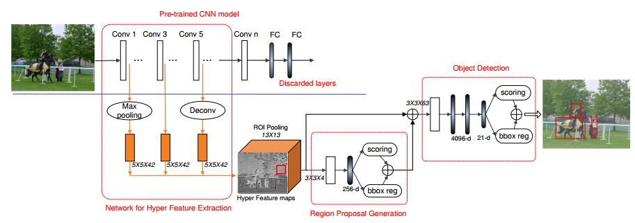

## Abstract
1. 使用"Feature Extraction+Region Proposal+RoI Classification" 的结构，主要对Feature Extraction进行重新设计。因为，Region Proposal部分计算量不太大而且classification部分可以使用通用的技术(例如：Truncated SVD) 进行有效的压缩。
2. 设计原则：Less channels with more layers 和采用一些Building blocks （包括：串级的ReLU、Inception和HyperNet)

  结果 
  VOC2007—83.8\%mAP；VOC2012—82.5\%mAP，46ms/image在NVIDIA Titan X GPU；计算量是ResNet-101的12.3\% (理论上)

## Introduction

 准确率很高的检测算法有往往需要很大的计算量。现在压缩和量化技术的发展对减小网络的计算量很重要。这篇文章展示了我们用于目标检测的一个轻量级的特征提取的网络结构——PVANET

串级的ReLU(C.ReLU—Concatenated rectified linear unit)被用在我们的CNNs 的初期阶段来减少一半的计算数量而不损失精度。
Inception\cite{GoogLeNet}被用在剩下的生成feature的子网络中。一个Inception module 产生不同大小的感受野（receptive fields）的输出激活值，所以增加前一层感受野大小的变化。我们观察叠加的Inception modules可以比线性链式的CNNs更有效的捕捉大范围的大小变化的目标。
采用multi-scale representation的思想\cite{HyperNet}, 结合多个中间的输出，所以，这使得可以同时考虑多个level的细节和非线性。我们展示设计的网络deep and thin，在batch normalization、residual connections和基于plateau detection的learning rate的调整的帮助下进行有效地训练

##  Review Related Work

## Nerual Network Design
### C.ReLU

    C.ReLU来源于CNN中间激活模式引发的。观察发现，输出节点倾向于是"配对的"，一个节点激活是另一个节点的相反面。

* 求同
    C.ReLU减少一半输出通数量，通过简单的连接相同的输出和negation 使其变成双倍，这使得2倍的速度提升而没有损失精度
* 存异
    同时，增加了scaling and shifting在concatenation之后，这允许每个channel 的斜率和激活阈值与其相反的channel不同。

### Inception
Inception是捕获图像中小目标和大目标的最具有成效的Building Blocks之一;
为了学习捕获大目标的视觉模式，CNN特征应该对应于足够大的感受野，这可以很容易的通过叠加 3x3或者更大的核卷积实现;
为了捕获小尺寸的物体，输出特征应该对应于足够小的感受野来精确定位小的感兴趣区域。

1x1的conv扮演了关键的角色，保留上一层的感受野。只是增加输入模式的非线性，它减慢了一些输出特征的感受野的增长，使得可以精确地捕获小尺寸的目标。

## 整个网络的结构

从中可以看出，在conv3\_4, conv4\_4, conv5\_4的输出特征通过下采样和上采样技术实现相同的size之后进行级联作为最后的卷积特征。

## Summary

1. C.ReLU减少训练过程中的网络大小
2. Inception是网络设计中的用于压缩网络的技巧
3. 1x1的使用相当于挖掘卷积结果中的冗余信息，从而减少channel个数

@article{GoogLeNet,
  author    = {Christian Szegedy and
               Wei Liu and
               Yangqing Jia and
               Pierre Sermanet and
               Scott E. Reed and
               Dragomir Anguelov and
               Dumitru Erhan and
               Vincent Vanhoucke and
               Andrew Rabinovich},
  title     = {Going Deeper with Convolutions},
  journal   = {CoRR},
  volume    = {abs/1409.4842},
  year      = {2014},
  url       = {http://arxiv.org/abs/1409.4842},
  timestamp = {Tue, 31 May 2016 18:15:20 +0200},
  biburl    = {http://dblp.uni-trier.de/rec/bib/journals/corr/SzegedyLJSRAEVR14},
  bibsource = {dblp computer science bibliography, http://dblp.org}
}
@article{HyperNet,
  author    = {Tao Kong and
               Anbang Yao and
               Yurong Chen and
               Fuchun Sun},
  title     = {HyperNet: Towards Accurate Region Proposal Generation and Joint Object
               Detection},
  journal   = {CoRR},
  volume    = {abs/1604.00600},
  year      = {2016},
  url       = {http://arxiv.org/abs/1604.00600},
  timestamp = {Mon, 02 May 2016 18:22:52 +0200},
  biburl    = {http://dblp.uni-trier.de/rec/bib/journals/corr/KongYCS16},
  bibsource = {dblp computer science bibliography, http://dblp.org}
}
@article{hong2016pvanet,
  title={{PVANet}: Lightweight Deep Neural Networks for Real-time Object Detection},
  author={Hong, Sanghoon and Roh, Byungseok and Kim, Kye-Hyeon and Cheon, Yeongjae and Park, Minje},
  journal={arXiv preprint arXiv:1611.08588},
  year={2016}
}
